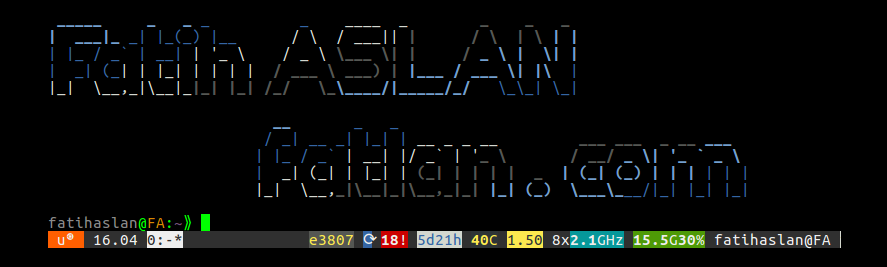

# 

# Kubernetes Toolkit

Teminator - [At its simplest Terminator is a terminal emulator like xterm, gnome-terminal, konsole, etc.](https://terminator-gtk3.readthedocs.io/en/latest/)  

Visual Studio Code - [Is a code editor redefined and optimized for building and debugging modern web and cloud applications](https://code.visualstudio.com/download)  

Lens - [The Kubernetes IDE](https://github.com/lensapp/lens)  

Portainer - [Is an open source tool for managing containerized(Kubernetes, Docker, Docker Swarm) applications](https://github.com/portainer/k8s)  

K9s provides a terminal UI - [Kubernetes CLI To Manage Your Clusters In Style](https://github.com/derailed/k9s)  

Kubectx + Kubens Power tools for kubectl - [Switch faster between clusters and namespaces in kubectl](https://github.com/ahmetb/kubectx)  

Kubectl-tree - [Kubectl plugin to browse Kubernetes object hierarchies as a tree](https://github.com/ahmetb/kubectl-tree)  

Web Kubectl - [Run kubectl command in web browser](https://github.com/KubeOperator/webkubectl)  

Weave Scope - [Troubleshooting & Monitoring for Docker & Kubernetes](https://github.com/weaveworks/scope)  

Kubebox - [Terminal and Web console for Kubernetes](https://github.com/astefanutti/kubebox)  

Kubewatch - [Kubernetes watcher that currently publishes notification to available collaboration hubs/notification channels](https://github.com/bitnami-labs/kubewatch)  

Rancher - [Complete Kubernetes+Container management platform](https://github.com/rancher/rancher)  

Kube-shell - [An integrated shell for working with the Kubernetes CLI](https://github.com/cloudnativelabs/kube-shell)  

Rook - Ceph Storage - [Ceph cluster and enable you to consume block, object, and file storage fot Kubernetes](https://rook.io/docs/rook/v1.5/ceph-quickstart.html)  

Longhorn - [Longhorn is a distributed block storage system for Kubernetes](https://github.com/longhorn/longhorn)  

Kubecolor - [Colorize your kubectl output](https://github.com/dty1er/kubecolor)  

Helm - [Helm is a tool for managing Charts](https://github.com/helm/helm)  

Kuberhaus - [Kubernetes resource dashboard with node/pod layout and resource requests](https://github.com/stevelacy/kuberhaus)  

KubeSphere - [One Kubernetes Platform for Full Stack Solutions](https://kubesphere.io/)  

K6 - [A modern load testing tool, using Go and JavaScript](https://github.com/k6io/k6)  

Kube-score - [Kubernetes object analysis with recommendations for improved reliability and security](https://github.com/zegl/kube-score)  

Kubespy - [Tools for observing Kubernetes resources in real time, powered by Pulumi](https://github.com/pulumi/kubespy)  

Popeye - [A Kubernetes cluster resource sanitizer](https://github.com/derailed/popeye)  

Sloop - [About Kubernetes History Visualization](https://github.com/salesforce/sloop)  

Kubevious - [Kubevious - application centric Kubernetes UI and continuous assurance provider](https://github.com/kubevious/kubevious)  

Ksniff - [Kubectl plugin to ease sniffing on kubernetes pods using tcpdump and wireshark ](https://github.com/eldadru/ksniff)  

Kubetail - [Bash script to tail Kubernetes logs from multiple pods at the same time ](https://github.com/johanhaleby/kubetail)  

Krew - [Krew is the package manager(find and install) for kubectl plugins](https://github.com/kubernetes-sigs/krew)  

Kubelogin - [kubectl plugin for Kubernetes OpenID Connect authentication (kubectl oidc-login)](https://github.com/int128/kubelogin)  

 

[and more](https://collabnix.github.io/kubetools/)
